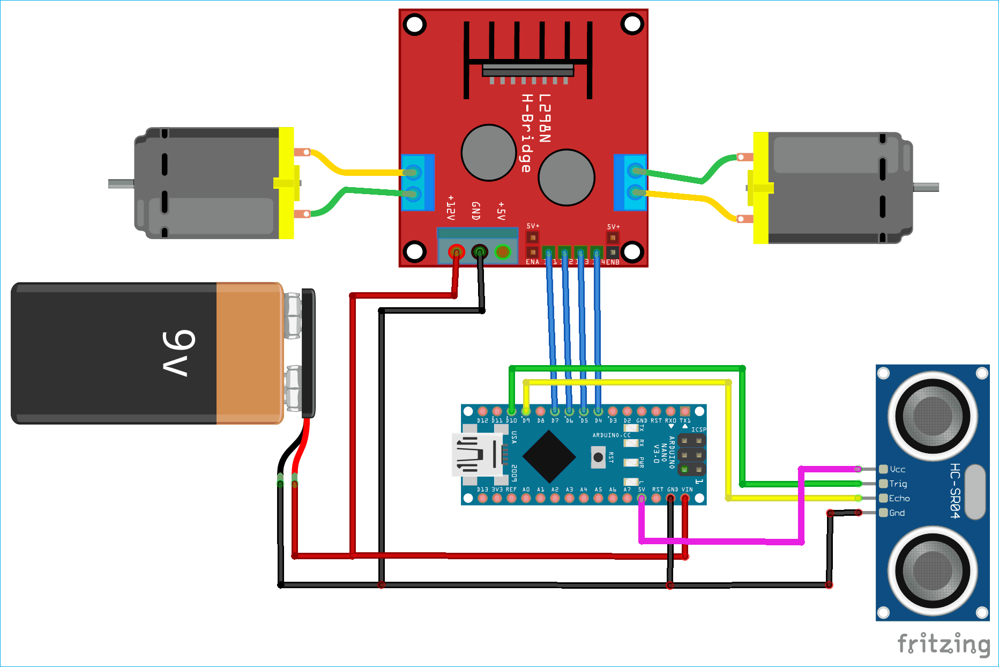

# Obstacle Avoidance Robot Car

An Arduino Nano-based obstacle-avoiding robot car that uses an **HC-SR04 ultrasonic sensor** to detect obstacles and maneuvers accordingly using **4 DC motors** controlled via an **L293D motor driver**.

---

## 🚗 How It Works

The robot moves forward by default. When the ultrasonic sensor detects an obstacle within 20cm, it:

1. Stops
2. Turns left briefly
3. Attempts to move forward again

You can enhance this logic to include right turns or more advanced scanning.

---

## 🧰 Components Required

| Component             | Quantity |
|----------------------|----------|
| Arduino Nano          | 1        |
| L293D Motor Driver     | 1        |
| HC-SR04 Ultrasonic Sensor | 1    |
| DC Motors (gear motors)  | 4    |
| Chassis + Wheels       | 1 set   |
| Jumper Wires           | As needed |
| Power Supply (Battery Pack) | 1  |
| Breadboard or Soldered Board | 1 (optional) |

---

## ⚙️ Pin Connections

### 🔌 Motor Driver (L293D)
| L293D Pin | Arduino Nano |
|----------|----------------|
| IN1      | D2             |
| IN2      | D3             |
| IN3      | D4             |
| IN4      | D5             |
| ENA/ENB  | 5V (or PWM pins for speed control) |

### 📡 Ultrasonic Sensor (HC-SR04)
| Sensor Pin | Arduino Nano |
|------------|---------------|
| VCC        | 5V            |
| GND        | GND           |
| Trig       | D9            |
| Echo       | D10           |

---

## 🔌 Power

Make sure to power the motor driver with a separate battery pack (e.g., 6x AA or Li-ion) and **share the GND** with the Arduino Nano.

---

## 🖥️ Arduino Code

The full Arduino sketch is provided in `obstacle_avoidance.ino`.

### Features:
- Forward movement by default
- Obstacle detection using HC-SR04
- Turns left if obstacle is detected

---

## 📜 License

This project is open-source and available under the MIT License.

---

## 🤝 Contributing

Pull requests and improvements are welcome! Open an issue or submit a PR.
